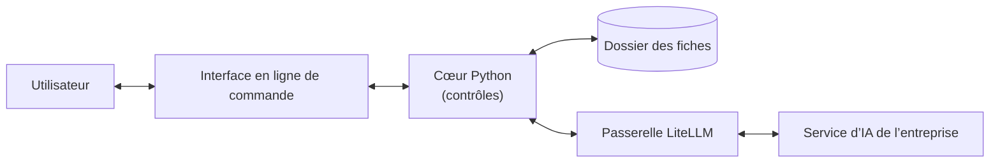

# Schéma du cadre technique

Cadre retenu par l’équipe outillage pour l’assistant des fiches support.

```mermaid
flowchart LR
    U["Utilisateur"] <--> L["Interface en ligne de commande"]
    L <--> C["Cœur Python<br>(contrôles)"]
    C <--> F[("Dossier des fiches")]
    C <--> P["Passerelle LiteLLM"]
    P <--> S["Service d’IA de l’entreprise"]
```
